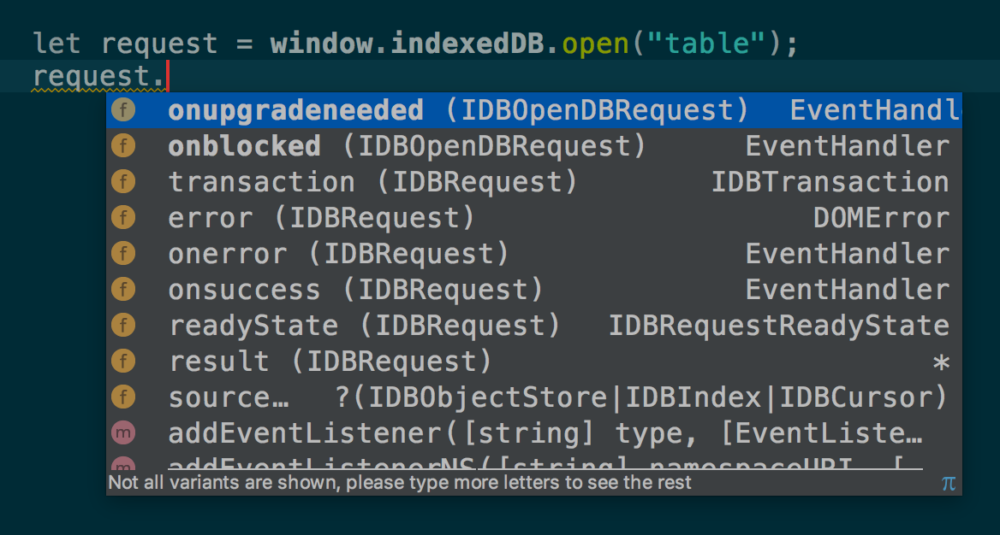
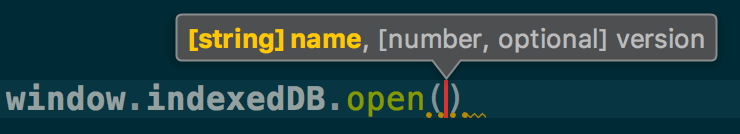
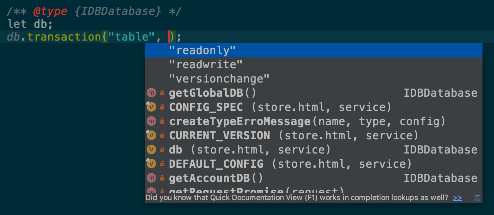
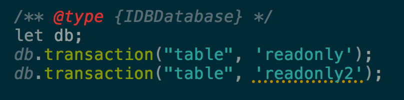
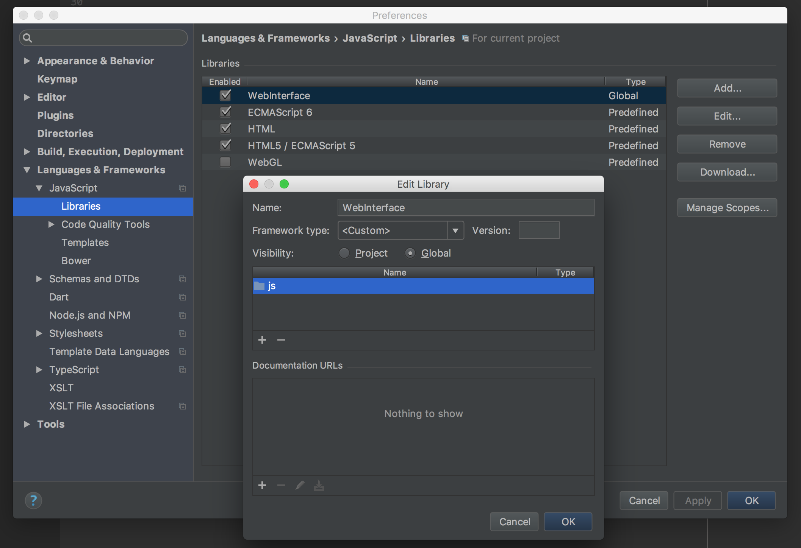

# Web Interface
Generate placeholder JavaScript code and [JSDoc](http://usejsdoc.org/) from [WebIDL](https://www.w3.org/TR/WebIDL-1/) for IDE auto-completion and type check.

Optimized for WebStorm.

# Screenshots

Method auto completion

Params auto completion

Params type-sensitive completion

Params validation

# Usage

Clone this library to local `git clone https://github.com/ranmocy/web-interface.git`.
Setup your IDE to add `web-interface/js` folder to be a library.
Note: Do not include this folder to your production code. This is for IDE only.

WebStorm:

# Supported API

1. [IndexedDB](https://www.w3.org/TR/IndexedDB/)
2. ...Upcoming

# Dev

Install deps: `npm install`

To get WebIDL: `node . update`

To generate JS files from WebIDL: `node .`

To test: `node . all && if ! git diff-index --quiet HEAD; then exit 1; fi`

## Deps

1. [WebIDL2](https://github.com/w3c/webidl2.js)
2. [webidl-extract](https://github.com/AndreasMadsen/webidl-extract)
